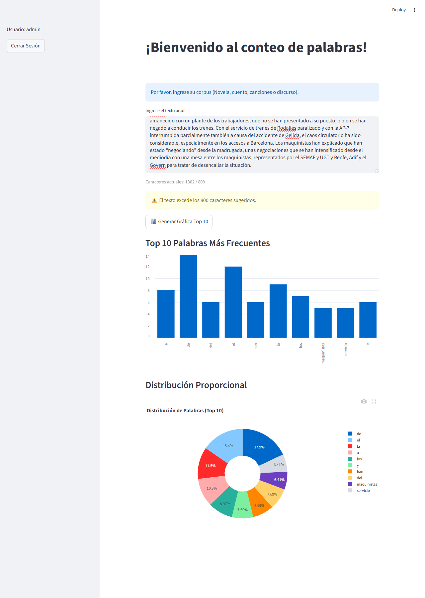

# 📊 Proyecto de Conteo de Palabras y Dashboard

Este repositorio contiene herramientas prácticas para introducirse en el Procesamiento de Lenguaje Natural (NLP) usando Python. El proyecto evoluciona desde un script básico de análisis de texto hasta un Dashboard web interactivo y seguro.



## 📁 Contenido del Proyecto

### 1. `01_conteo_palabras.py` (Script Introductorio)
Un script de Python puro que demuestra los fundamentos del análisis de texto:
- **Normalización**: Conversión a minúsculas.
- **Tokenización**: Uso de Expresiones Regulares (`re`) para separar palabras.
- **Conteo**: Uso de `collections.Counter` para calcular frecuencias.
- **Visualización**: Generación de un gráfico de barras estático con `matplotlib`.

### 2. `01_Dashboard_conteo.py` (Aplicación Web)
Una aplicación completa construida con **Streamlit** que lleva el análisis al siguiente nivel, ofreciendo una interfaz gráfica amigable.

**Características Principales:**
- **🔐 Acceso Seguro**: Sistema de login (Usuario: `admin`, Contraseña: `1234`).
- **📝 Entrada Flexible**: Campo de texto para analizar cualquier corpus (novelas, discursos, etc.) con contador de caracteres.
- **📊 Visualización Interactiva**:
    - **Gráfico de Barras**: Frecuencia absoluta de palabras.
    - **Gráfico de Donut (Pie Chart)**: Distribución proporcional interactiva con **Plotly**.

## 🚀 Cómo Ejecutar

### Requisitos
Asegúrate de tener instaladas las librerías necesarias:
```bash
pip install streamlit plotly matplotlib pandas
```

### Ejecutar el Dashboard
Para lanzar la aplicación web:
```bash
streamlit run 01_Dashboard_conteo.py
```
Esto abrirá automáticamente el dashboard en tu navegador.

---
*Proyecto desarrollado para aprender fundamentos de NLP y visualización de datos con Python.*
